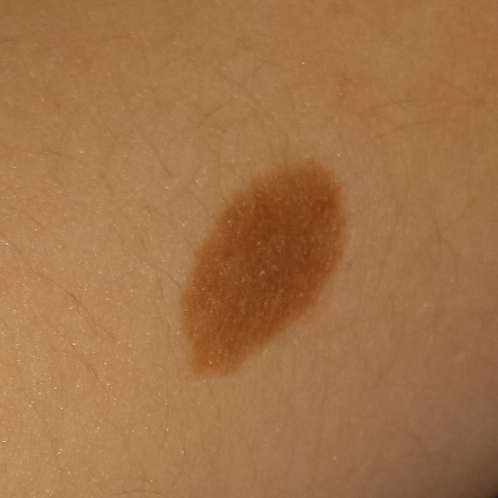
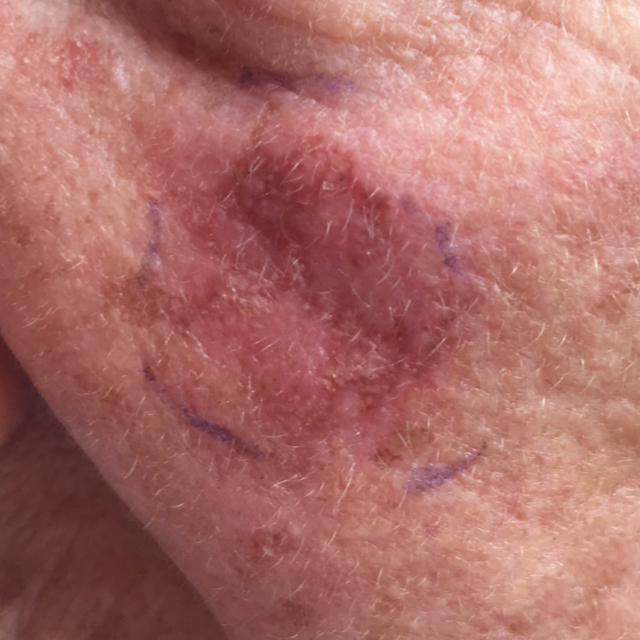

# Possible Datasets

This document summarizes datasets considered for this project.

## Brain Stroke

### Numerical

- [patient-information](https://www.kaggle.com/datasets/jillanisofttech/brain-stroke-dataset/data)

| gender | age | hypertension | heart_disease | ever_married | work_type | Residence_type | avg_glucose_level |  bmi  | smoking_status   | stroke |
|--------|-----|--------------|---------------|--------------|-----------|----------------|-------------------|-------|------------------|--------|
| Male   | 67  | 0            | 1             | Yes          | Private   | Urban          | 228.69            | 36.6  | formerly smoked  | 1      |
| Male   | 80  | 0            | 1             | Yes          | Private   | Rural          | 105.92            | 32.5  | never smoked     | 1      |
| Female | 49  | 0            | 0             | Yes          | Private   | Urban          | 171.23            | 34.4  | smokes           | 1      |

- [patient-information](https://www.kaggle.com/datasets/fedesoriano/stroke-prediction-dataset)
- [paper](https://pmc.ncbi.nlm.nih.gov/articles/PMC8641997/?utm_source=chatgpt.com#B16)

### Image

- [ct-scan](https://www.kaggle.com/datasets/ozguraslank/brain-stroke-ct-dataset/data)

## Knee Osteoarthritis

### Numerical

- [patient-information](https://datasetsearch.research.google.com/search?src=0&query=Osteoarthritis&docid=L2cvMTFsbWw1N3MweQ%3D%3D&filters=WyJbXCJmaWxlX2Zvcm1hdF9jbGFzc1wiLFtcIjFcIl1dIl0%3D&property=ZmlsZV9mb3JtYXRfY2xhc3M%3D)

# Prognostic Model Data

| Variable              | Category         | Total N = 2005 | Training Set n = 1002 | Test Set n = 1003 | MOST N = 1155  |
|-----------------------|-----------------|----------------|-----------------------|-------------------|-----------------|
| **BMI**               | Less than 25    | 644            | 329                   | 315               | 234             |
|                       | 25–29.9         | 814            | 409                   | 405               | 478             |
|                       | 30+             | 547            | 264                   | 283               | 443             |
| **Family History**    | No              | 1601           | 800                   | 801               | 328 [352]       |
|                       | Yes             | 404            | 202                   | 202               | 475             |
| **Ever Injured Knee** | No              | 1239           | 621                   | 618               | 671             |
|                       | Yes             | 766            | 381                   | 385               | 484             |
| **History of Falling**| No              | 1341           | 624                   | 717               | 130 [1003]      |
|                       | Yes             | 664            | 378                   | 286               | 22              |
| **Gender**            | Male            | 895            | 373                   | 522               | 693             |
|                       | Female          | 1110           | 629                   | 481               | 462             |
| **WOMAC**             | —               | 0–82 (6.8)     | 0–71 (8)              | 0–82 (5)          | 0–82 (10) [4 8] |
| **KOA**               | Censored        | 1839           | 913                   | 926               | 1004            |
|                       | Develop KOA     | 166            | 89                    | 77                | 151             |

### Image

- [x-ray](https://www.kaggle.com/datasets/shashwatwork/knee-osteoarthritis-dataset-with-severity)

## Fetus Health

### Numerical

- [patient-information](https://www.kaggle.com/datasets/andrewmvd/fetal-health-classification/data)

| baseline_value | accelerations | fetal_movement | uterine_contractions | light_decelerations | severe_decelerations | prolongued_decelerations | abnormal_short_term_variability | mean_value_of_short_term_variability | percentage_of_time_with_abnormal_long_term_variability | mean_value_of_long_term_variability | histogram_width | histogram_min | histogram_max | histogram_number_of_peaks | histogram_number_of_zeroes | histogram_mode | histogram_mean | histogram_median | histogram_variance | histogram_tendency | fetal_health |
|----------------|---------------|----------------|----------------------|---------------------|----------------------|--------------------------|---------------------------------|--------------------------------------|-------------------------------------------------------|------------------------------------|----------------|---------------|---------------|---------------------------|---------------------------|----------------|----------------|------------------|-------------------|-------------------|--------------|
| 120.0          | 0.0           | 0.0            | 0.0                  | 0.0                 | 0.0                  | 0.0                      | 73.0                            | 0.5                                  | 43.0                                                  | 2.4                                | 64.0           | 62.0          | 126.0         | 2.0                       | 0.0                       | 120.0          | 137.0          | 121.0            | 73.0               | 1.0               | 2.0          |
| 132.0          | 0.006         | 0.0            | 0.006                | 0.003               | 0.0                  | 0.0                      | 17.0                            | 2.1                                  | 0.0                                                   | 10.4                               | 130.0          | 68.0          | 198.0         | 6.0                       | 1.0                       | 141.0          | 136.0          | 140.0            | 12.0               | 0.0               | 1.0          |
| 133.0          | 0.003         | 0.0            | 0.008                | 0.003               | 0.0                  | 0.0                      | 16.0                            | 2.1                                  | 0.0                                                   | 13.4                               | 130.0          | 68.0          | 198.0         | 5.0                       | 1.0                       | 141.0          | 135.0          | 138.0            | 13.0               | 0.0               | 1.0          |

### Image

- [ultrasound](https://www.kaggle.com/datasets/orvile/ultrasound-fetus-dataset)

## Thyroid

### Numerical

- [patient-information](https://www.kaggle.com/datasets/emmanuelfwerr/thyroid-disease-data)

| age | sex | on_thyroxine | query_on_thyroxine | on_antithyroid_meds | sick | pregnant | thyroid_surgery | I131_treatment | query_hypothyroid | query_hyperthyroid | lithium | goitre | tumor | hypopituitary | psych | TSH_measured |  TSH | T3_measured |  T3  | TT4_measured | TT4  | T4U_measured | T4U | FTI_measured | FTI | TBG_measured | TBG | referral_source | target | patient_id  |
|-----|-----|--------------|---------------------|----------------------|------|----------|----------------|----------------|-------------------|--------------------|---------|--------|-------|----------------|-------|--------------|------|-------------|------|---------------|------|---------------|-----|---------------|-----|---------------|-----|----------------|--------|-------------|
| 29  | F   | f            | f                   | f                    | f    | f        | f              | f              | t                 | f                  | f       | f      | f     | f              | f     | t            | 0.3  | f           | f    | f             | f    | f             | f   | f             | f   | other          | -      | 840801013   |
| 29  | F   | f            | f                   | f                    | f    | f        | f              | f              | f                 | f                  | f       | f      | f     | f              | f     | t            | 1.6  | t           | 1.9  | t             | 128  | f             | f   | f             | f   | other          | -      | 840801014   |
| 41  | F   | f            | f                   | f                    | f    | f        | f              | f              | f                 | t                  | f       | f      | f     | f              | f     | f            | —    | f           | —    | f             | —    | t             | 11  | —             | —   | other          | -      | 840801042   |

- [patient-information](https://www.kaggle.com/datasets/jainaru/thyroid-disease-data)

| Age | Gender | Smoking | Hx Smoking | Hx Radiotherapy | Thyroid Function | Physical Examination         | Adenopathy | Pathology      | Focality   | Risk |  T   |  N  |  M  | Stage | Response      | Recurred |
|-----|--------|---------|------------|-----------------|------------------|-----------------------------|------------|----------------|------------|------|------|-----|-----|-------|---------------|----------|
| 27  | F      | No      | No         | No              | Euthyroid        | Single nodular goiter-left  | No         | Micropapillary | Uni-Focal  | Low  | T1a  | N0  | M0  | I     | Indeterminate | No       |
| 34  | F      | No      | Yes        | No              | Euthyroid        | Multinodular goiter         | No         | Micropapillary | Uni-Focal  | Low  | T1a  | N0  | M0  | I     | Excellent     | No       |
| 30  | F      | No      | No         | No              | Euthyroid        | Single nodular goiter-right | No         | Micropapillary | Uni-Focal  | Low  | T1a  | N0  | M0  | I     | Excellent     | No       |

### Image

- [ultrasound](https://www.kaggle.com/datasets/dasmehdixtr/ddti-thyroid-ultrasound-images?select=111.xml)

## Kidney Stones

- [patient-information](https://www.kaggle.com/datasets/vuppalaadithyasairam/kidney-stone-prediction-based-on-urine-analysis)

| gravity |  ph  | osmo | cond | urea | calc | target |
|:--------:|:----:|:----:|:----:|:----:|:----:|:------:|
| 1.021    | 4.91 | 725  | 14   | 443  | 2.45 |   0    |
| 1.017    | 5.74 | 577  | 20   | 296  | 4.49 |   0    |
| 1.008    | 7.2  | 321  | 14.9 | 101  | 2.36 |   0    |

- [patient-information](https://www.kaggle.com/datasets/harshghadiya/kidneystone)

| index | gravity |  ph  | osmo | cond | urea | calc | target |
|:-----:|:--------:|:----:|:----:|:----:|:----:|:----:|:------:|
|   0   | 1.021    | 4.91 | 725  | 14.0 | 443  | 2.45 |   0    |
|   1   | 1.017    | 5.74 | 577  | 20.0 | 296  | 4.49 |   0    |
|   2   | 1.008    | 7.20 | 321  | 14.9 | 101  | 2.36 |   0    |

### Image

- [ultrasound](https://www.kaggle.com/datasets/imtkaggleteam/kidney-stone-classification-and-object-detection)

- [ct-scan](https://www.kaggle.com/datasets/safurahajiheidari/kidney-stone-images)

## PCOS

- [patient-information](https://www.kaggle.com/datasets/prasoonkottarathil/polycystic-ovary-syndrome-pcos)

> [!NOTE]
> The table below displays only 6 columns for illustration purposes. The full dataset contains a total of 45 columns.

| Sl. No | Patient File No. | PCOS (Y/N) | Age (yrs) | Weight (Kg) | Height (Cm) | BMI       | Blood Group | Pulse rate (bpm) | RR (breaths/min) |
|--------|------------------|------------|-----------|-------------|-------------|-----------|--------------|------------------|------------------|
| 1      | 1                | 0          | 28        | 44.6        | 152         | 19.3      | 15           | 78               | 22               |
| 2      | 2                | 0          | 36        | 65          | 161.5       | 24.921163 | 15           | 74               | 20               |

### Image

- [ultrasound](https://www.kaggle.com/datasets/anaghachoudhari/pcos-detection-using-ultrasound-images)

## Multiple Sclerosis

### Numerical

[patient-information](https://www.kaggle.com/datasets/desalegngeb/conversion-predictors-of-cis-to-multiple-sclerosis)

### Image

**About the Dataset**  
This dataset contains brain MRI scans (axial, sagittal, and combined views) from 72 MS patients and 59 healthy controls, collected at Ozal University Medical Faculty (2021).  
- **Images**: 1652 axial, 1775 sagittal, 3427 combined (all resized to 224 × 224).  
- **Classes**: Multiple Sclerosis (MS) vs. Healthy.  
- **Features**: Designed for both deep learning (CNN) and feature engineering approaches.  
  **Dataset Link**: [Kaggle – Multiple Sclerosis by BurakTaçci](https://www.kaggle.com/datasets/buraktaci/multiple-sclerosis)

## Skin Lesions

[PAD-UFES-20](https://data.mendeley.com/datasets/zr7vgbcyr2/1): a skin lesion dataset composed of patient data and clinical images collected from smartphones

#### Numerical Data

|patient_id|lesion_id|smoke|drink|background_father|background_mother|age|pesticide|gender|skin_cancer_history|cancer_history|has_piped_water|has_sewage_system|fitspatrick|region |diameter_1|diameter_2|diagnostic|itch |grew |hurt |changed|bleed|elevation|img_id               |biopsed|
|----------|---------|-----|-----|-----------------|-----------------|---|---------|------|-------------------|--------------|---------------|-----------------|-----------|-------|----------|----------|----------|-----|-----|-----|-------|-----|---------|---------------------|-------|
|PAT_1516  |1765     |     |     |                 |                 |8  |         |      |                   |              |               |                 |           |ARM    |          |          |NEV       |False|False|False|False  |False|False    |PAT_1516_1765_530.png|False  |
|PAT_46    |881      |False|False|POMERANIA        |POMERANIA        |55 |False    |FEMALE|True               |True          |True           |True             |3.0        |NECK   |6.0       |5.0       |BCC       |True |True |False|True   |True |True     |PAT_46_881_939.png   |True   |
|PAT_1545  |1867     |     |     |                 |                 |77 |         |      |                   |              |               |                 |           |FACE   |          |          |ACK       |True |False|False|False  |False|False    |PAT_1545_1867_547.png|False  |

#### Image Data

# Final Decision

✅ After reviewing all datasets the chosen one was **Skin Lesions**
